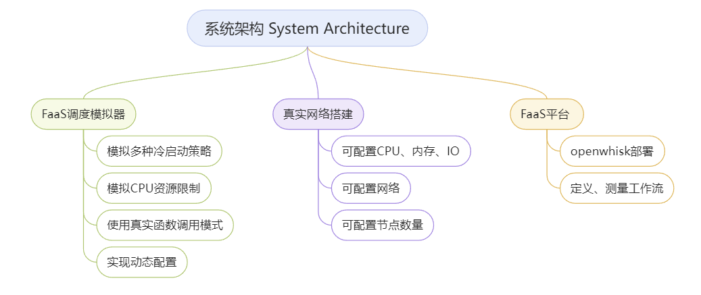
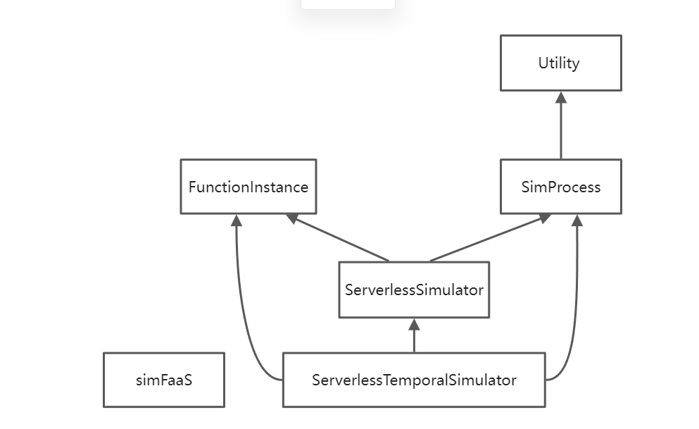
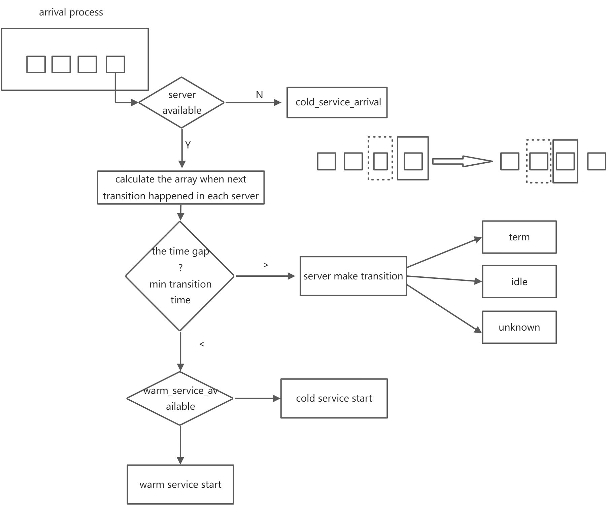

# 面向工作流应用的Serverless平台  

## 设计目标

​	现有的Serverless计算平台资源调度的缺点也制约了工作流应用的性能。具体而言，现有的开源 Serverless计算平台缺少函数资源亲和性调度，这使得工作流应用函数调度在不同的服务器节点上，产生跨节点通信带来的额外开销；此外，绝大多数Serverless平台CPU与内存资源的等比分配策略也缺乏更多资源调度的灵活性。这种粗粒度的资源调度方式，无法适应不同函数对于资源的不同需求，过剩的内存与CPU资源也让工作流应用的资源利用率低下。
​	为此，本课题将基于目前主流的开源Serverless平台OpenWhisk，通过对实际Serverless工作流应用的部署与测量，分析平台的资源调度系统的行为；找出应用工作流与资源调度有关的性能瓶颈，并针对性地制定合理的资源调度策略，改进平台资源调度系统的架构，最终实现提升应用工作流性能与平台的资源利用率的目标。

## 系统架构


## 目录说明

-essay(论文阅读)

-sysanalysis（系统分析）

​	-simulator（模拟器分析）

​	-nativecloud (云原生分析)

​	-faasworkload (工作流分析)

-simulator

​	-simfaas(模拟器代码)

​	-test.py（模拟器测试文件）

​	-invocations_per_function_md.anon.d[01-14].csv（数据集）

-readme.md（本说明文件）

## 模拟器

### 设计目标

- 基于SimfaaS这个比较基础的模拟器拓展功能

- 模拟多种冷启动策略（预置容器、直方图预测）
- 模拟CPU资源限制
- 使用真实函数的调用模式
- 实现动态参数配置

### 模块功能



总的来说，FunctionInstance是server的原型，SimProcess是request、warm service和cold service的原型，容器状态变化、调用模拟、容器统计的基本模拟逻辑在ServerlessSimulator里。


### 使用方式

- 基本使用

```
#安装simfaaS
pip install simfaas
```

```python
from simfaas.ServerlessSimulator import ServerlessSimulator as Sim
sim = Sim(arrival_rate=0.9, warm_service_rate=1/1.991, cold_service_rate=1/2.244,
            expiration_threshold=600, max_time=1e6)
sim.generate_trace(debug_print=False, progress=True
sim.print_trace_results()
```

- 进阶开发使用

```
pip install simfaas
```

进入simfaas目录

```
# 进入到setup.py同级的目录下
python setup.py sdist bdist_wheel
```

链接到simfaas

```
pip install e .
```

进入simulator文件夹

```
python test.py
```

### 真实调用

#### 数据来源

真实调用数据来自Azure function的数据集Azure-public-dataset[GItHub地址 GitHub - Azure/AzurePublicDataset: Microsoft Azure Traces](https://github.com/Azure/AzurePublicDataset)；使用论文Serverless in the Wild: Characterizing and Optimizing the Serverless Workload at a Large Cloud Provider的trace(https://github.com/Azure/AzurePublicDataset/blob/master/AzureFunctionsDataset2019.md进行模拟。

文件名为invocations_per_function_md.anon.d[01-14].csv

1． 调用次数：每个函数，每分钟内

2． 每个函数的触发器

3． 每个函数的执行时间：平均、最小、最大、样本数量、每三十秒间隔调用情况、每个任务对象

4． 每个应用内存使用情况：运行时和平均每五秒钟抽样调查情况、每个任务对象、每分钟。

所有常驻或者分配的内存的平均值、最小值、最大值、样本数量

#### **数据处理**

通过生成伪随机数，将每个时间片的数据模拟成实时调用的函数间隔（IT）序列

```python
import csv
import random
from simfaas.ServerlessSimulator import ServerlessSimulator as Sim
from simfaas.SimProcess import ReqSimProcess
f=csv.reader(open('invocations_per_function_md.anon.d13.csv'))
rows=[row for row in f]
print rows
gaps=[]
for i in range(1,2):
    gap=rows[i][4:]
    gaps.append(gap)
time_gap_list=[[] for i in range(1)]
time_list=[[] for i in range(1)]
row_count=0
for row in gaps:
    count=0
    for i in row:
        i=int(i)
        if(i!=0):
            j=i
            while j:
                random.seed()
                time_list[row_count].append(round(count+random.random(),1))
                time_list[row_count].sort()
                time_before=0
                for time in time_list[row_count]:
                    time_gap=round(time-time_before,2)
                    time_gap_list[row_count].append(time_gap)
                    time_before=time
                j-=1
        count=count+1
        continue
```

#### **进程模型**

```python
class ReqSimProcess(SimProcess):
    """ReqSimProcess extends the functionality of :class:'~simfaas.SimProcess.SimProcess' for
    random time gap processes.

    Parameters
    ----------
    time : array
        the time gap array of the process should fire off
    """
    def __init__(self,time):
        super().__init__()
        self.has_pdf= False
        self.has_cdf= False
        self.time=time
    def generate_trace(self, time,i):
        return time[i]
```

#### 使用方式

```python
sim =Sim(ReqSimProcess(time=time_gap_list[0]),warm_service_rate=1/1.991,cold_service_rate=1/2.244,expiration_threshold=600,max_time=1e4,preset_servers_count=1)
sim.generate_trace(debug_print=False,progress=True)
sim.print_trace_results()
```

### 多种冷启动策略

#### 预置容器

增加simulator原型的参数preset_servers_count=0,preset_servers=[]，preset_servers_count代表预置容器数量，preset_server则表示容器数组，如果不填的话会默认创建和其他容器冷热启动模型一样的，但阈值更大（600000）的容器

- init函数

```python
def __init__(self, arrival_process=None, warm_service_process=None, 
    cold_service_process=None, expiration_threshold=600, max_time=24*60*60,
    maximum_concurrency=1000, preset_servers_count=0,preset_servers=[],**kwargs):
    super().__init__()
	self.preset_servers_count=preset_servers_count
    self.preset_servers=preset_servers
    if preset_servers_count>0:
    	for i in range(preset_servers_count): 					 self.preset_servers.append(FunctionInstance(0,self.cold_service_process, self.warm_service_process,expiration_threshold=600000)) 
```

- reset_trace函数

current state的instance初始值调整

```python
  def reset_trace(self):
        """resets all the historical data to prepare the class for a new simulation
        """
        # an archive of previous servers
        self.prev_servers = []
        self.total_req_count = 0
        self.total_cold_count = 0
        self.total_warm_count = 0
        self.total_reject_count = 0
        # current state of instances
        #self.servers = []
        #self.server_count = 0
        self.running_count = self.preset_servers_count
        self.idle_count = 0
        self.servers = self.preset_servers
        self.server_count = self.preset_servers_count
        # history results
        self.hist_times = []
        self.hist_server_count = []
        self.hist_server_running_count = []
        self.hist_server_idle_count = []
        self.hist_req_cold_idxs = []
        self.hist_req_warm_idxs = []
        self.hist_req_rej_idxs = []
```


